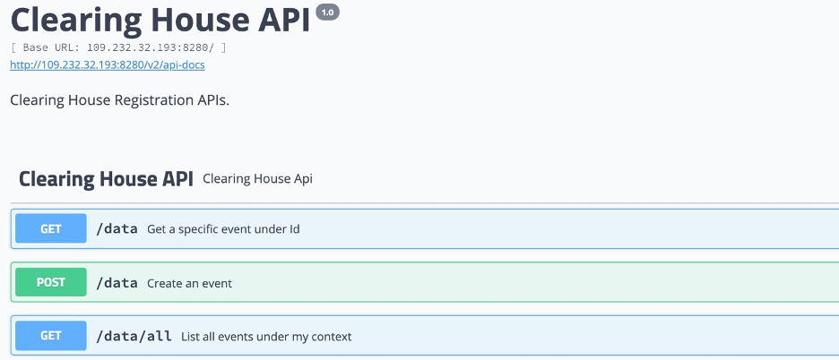
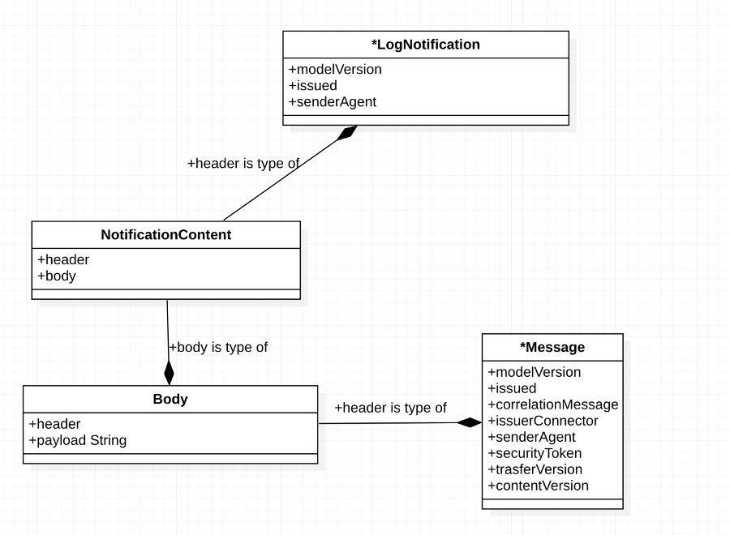

## IDS clearing house

The IDS clearing house is an intermediary role in the IDS architecture, it is based on the [IDSA Clearing House Specifications](mailto:https://industrialdataspace.jiveon.com/docs/DOC-2524#jive_content_id_45_Clearing_House_Interactions) and his main aim is to provide a broad set of supporting clearing and settlement functions in alignment with the IDS service architecture approach.

In the IDSA Scenario through the clearing house the connector brokers could register and log transactions in order to prove the correct information transfer across them.

Our implementation is based on a Blockchain Network in order to distribute the clearing functionalities on multiple nodes. Each node keeps a global state of the transactions.

The Blockchain implementation is based on Hyperledger Fabric a permissioned DLT, mainly used in Enterprise software scenarios.

The IDS clearing house software release is composed by two components:

- **Clearing House Chaincode** (the software running inside the Blockchain aka Smart Contract) available on the public Github repository at [https://github.com/Engineering-Research-and-Development/market4.0-clearing_house_chaincode](https://github.com/Engineering-Research-and-Development/market4.0-clearing_house_chaincode)
- **Clearing House Service** (the REST API to interact with the Blockchain following the IDSA Specs) available on the public Github repository at [https://github.com/Engineering-Research-and-Development/market4.0-clearing_house](https://github.com/Engineering-Research-and-Development/market4.0-clearing_house)

**API Documentation**

The API is composed by three Operations:

| **Endpoint** | **Input** | **Output** | **Description** |
| --- | --- | --- | --- |
| GET /data | Parameter **Id (String)** of the class de.fraunhofer.iais.eis.LogNotification | \*NotificationContent Object | Retrieve all transaction by a specific Id |
| POST /data | Parameter **notificationContent** of class NotificationContent | Success or Failure | Record a new transaction |
| GET /data/all |
 | List of NotificationContent Objects | Retrieve all transactions |

\*The it.eng.idsa.clearinghouse.model.NotificationContent is a new Model composed by an header within a LogNotification and a Body composed by a Message object and a string payload.

The size of the payload is limited to 64 characters.

Under an example of the Model in JSON format and a diagram showing the NotificationContent components.

{

&quot;header&quot;: {

&quot;@type&quot;: &quot;ids:LogNotification&quot;,

&quot;issuerConnector&quot;: &quot;auto-generated&quot;,

&quot;securityToken&quot;: null,

&quot;issued&quot;: &quot;2020-07-02T07:11:55.825Z&quot;,

&quot;modelVersion&quot;: null,

&quot;recipientConnector&quot;: null,

&quot;recipientAgent&quot;: null,

&quot;correlationMessage&quot;: null,

&quot;senderAgent&quot;: null,

&quot;authorizationToken&quot;: null,

&quot;transferContract&quot;: null,

&quot;contentVersion&quot;: null,

&quot;@id&quot;:

&quot; **https://w3id.org/idsa/autogen/logNotification/ce5d4853-80c7-4f65-b800-31bcc64d7bce**&quot;

},

&quot;body&quot;: {

&quot;header&quot;: {

&quot;@type&quot;: &quot;ids:Message&quot;,

&quot;issuerConnector&quot;: &quot;http://iais.fraunhofer.de/ids/mdm-connector&quot;,

&quot;securityToken&quot;: null,

&quot;issued&quot;: &quot;2019-05-27T13:09:42.306Z&quot;,

&quot;modelVersion&quot;: &quot;1.0.2-SNAPSHOT&quot;,

&quot;recipientConnector&quot;: null,

&quot;recipientAgent&quot;: null,

&quot;correlationMessage&quot;: &quot;http://industrialdataspace.org/connectorUnavailableMessage/1a421b8c-3407-44a8-aeb9-253f145c869a&quot;,

&quot;senderAgent&quot;: null,

&quot;authorizationToken&quot;: null,

&quot;transferContract&quot;:

&quot;https://mdm-connector.ids.isst.fraunhofer.de/examplecontract/bab-bayern-sample/&quot;,

&quot;contentVersion&quot;: null,

&quot;@id&quot;:

&quot;https://w3id.org/idsa/autogen/artifactResponseMessage/eb3ab487-dfb0-4d18-b39a-585514dd044f&quot;

},

&quot;payload&quot;: &quot; **dafd135e0c9e7d80b615de88effb15233a68026361bdf4cad0fba26d82040be2**&quot;

}

}

\* The LogNotification and Message are part of the **IDSA Information Model**.

### How to Configure and Run

**Prerequisites**

- Linux Environment.
- Administrative access to the machine.
- Access to Internet.
- Install Hyperledger Fabric version 1.4 following this installation guide available [here](mailto:https://hyperledger-fabric.readthedocs.io/en/release-1.4/build_network.html#building-your-first-network).

**Chaincode Installation**

- Clone the repository: git clone https://github.com/Engineering-Research-and-Development/ market4.0-clearing\_house\_chaincode.git
- Copy the chaincode folder under your HLF installation machine.
- To install the chaincode follow the instructions given in the following guide available [here](mailto:https://hyperledger-fabric.readthedocs.io/en/release-1.4/chaincode4noah.html#installing-chaincode).

**Service Installation**

- Clone the repository: git clone https://github.com/Engineering-Research-and-Development/ market4.0-clearing\_house.git
- Go to the clearing-house-apifolder and edit the docker-compose.yaml, using your own **user** , **volumes** containing the wallet with the identities and the **crypto-config** folder with the digital certificates to access the Blockchain.

version: &#39;2.2&#39;

services:

clearing-house:

image: market4.0/clearing-house

ports:

- 8080:8080

environment:

- SPRING\_PROFILES\_ACTIVE=container

- PORT=8080

- LOG\_LEVEL=info

- WALLET\_PATH=/wallet

- USER\_NAME= **user1**

- CHAINCODE\_NAME=clearing-house-chaincode

- CERT\_FILENAME=/crypto-config/peerOrganizations/org1.example.com/users/ **User1@org1.example.com/msp/signcerts/User1@org1.example.com-cert.pem**

- KEYSTORE\_FILENAME=/crypto-config/peerOrganizations/org1.example.com/users/ **User1@org1.example.com/msp/keystore/keystore\_sk**

- NETWORK\_FILENAME=connection\_container.json

volumes:

- ./wallet:/ **wallet**

- /crypto-config:/ **crypto-config**

external\_links:

- ca.example.com

- orderer.example.com

- peer0.org1.example.com

- peer1.org1.example.com

- peer2.org1.example.com

- peer3.org1.example.com

command: --spring.profiles.active=container

network\_mode: configurationservice\_byfn

- Execute in a terminal the command: **bash dockerize.sh** in order to start the service.

The Clearing House Service is now reachable at: http://<your_host>:8080/swagger-ui.html#

### How to Test

All the APIs are documented and testable via [Swagger](mailto:https://swagger.io/) using the Service URL:

http://<your_host>:8080/swagger-ui.html#

